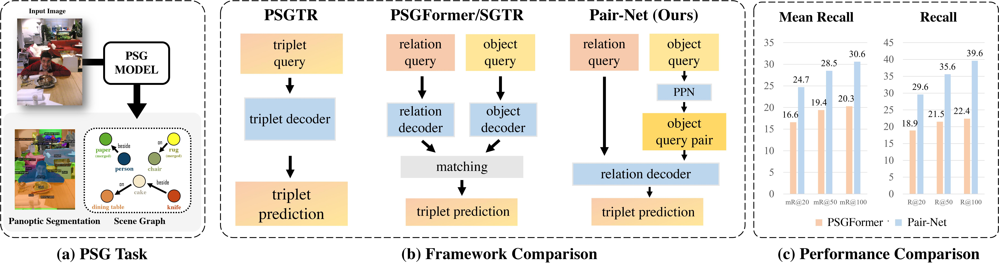

## <div align="center"> Pair then Relation: Pair-Net for Panoptic Scene Graph Generation<div>

#### <div align="center"> IEEE T-PAMI 2024<div>

<div align="center">
  <br>
  <a href="https://king159.github.io/" target="_blank">Jinghao Wang*</a>,&nbsp;
  <a href="https://scholar.google.com/citations?user=3bzBnCIAAAAJ" target="_blank">Zhengyu Wen*</a>,&nbsp;
  <a href="https://lxtgh.github.io/" target="_blank">Xiangtai Li</a>,&nbsp;
  <a href="https://gseancdat.github.io/" target="_blank">Zujing Guo</a>,&nbsp;
  <a href="http://jingkang50.github.io/" target="_blank">Jingkang Yang</a>,&nbsp;
  <a href="https://liuziwei7.github.io/" target="_blank">Ziwei Liu<sup>&#x2709;</sup></a>
</div>

<div align="center">
  <br>
  S-Lab, Nanyang Technological University
  <br>
  <sup>*</sup> Equal Contribution&emsp;
  <sup>&#x2709;</sup> Corresponding Author
</div>



<div align="center">
<a href=https://pytorch.org/get-started/previous-versions/
target="_blank"></a>
<a href=https://github.com/open-mmlab/mmdetection
target="_blank"></a>
<a href=https://arxiv.org/abs/2307.08699 target="_blank"></a>
</div>

## Abstract

Panoptic Scene Graph (PSG) is a challenging task in Scene Graph Generation (SGG) that aims to create a more comprehensive scene graph representation using panoptic segmentation instead of boxes. Compared to SGG, PSG has several challenging problems: pixel-level segment outputs and full relationship exploration (It also considers thing and stuff relation). Thus, current PSG methods have limited performance, which hinders downstream tasks or applications. This work aims to design a novel and strong baseline for PSG. To achieve that, we first conduct an in-depth analysis to identify the bottleneck of the current PSG models, finding that inter-object pair-wise recall is a crucial factor that was ignored by previous PSG methods. Based on this and the recent query-based frameworks, we present a novel framework: **Pair then Relation (Pair-Net)**, which uses a Pair Proposal Network (PPN) to learn and filter sparse pair-wise relationships between subjects and objects. Moreover, we also observed the sparse nature of object pairs for both. Motivated by this, we design a lightweight Matrix Learner within the PPN, which directly learns pair-wised relationships for pair proposal generation. Through extensive ablation and analysis, our approach significantly improves upon leveraging the segmenter solid baseline.Notably, our method achieves over 10% absolute gains compared to our baseline, PSGFormer.

## Codebase Structure

### Data Preparation

`psg.json` file can be downloaded from [OpenPSG](https://entuedu-my.sharepoint.com/:f:/g/personal/jingkang001_e_ntu_edu_sg/EgQzvsYo3t9BpxgMZ6VHaEMBDAb7v0UgI8iIAExQUJq62Q?e=fIY3zh), and the `coco` dataset can be downloaded from [COCO 2017](https://cocodataset.org/#download).

The resulting directory structure should be as follows:

<details>
  <summary>Click to expand/collapse</summary>

``` bash
├── configs
├── data
│   ├── coco
│   │   ├── annotations
|   │   │   ├── panoptic_train2017
|   │   │   ├── panoptic_val2017
│   │   ├── train2017
│   │   └── val2017
│   └── psg
│       ├── psg.json
├── pretrain
├── pairnet
├── scripts
├── tools
│   ├── train.py
│   ├── test.py
├── work_dirs
├── ...
```

</details>

### Environment Setup

We recommend using Anaconda to set up the environment:

<details>
  <summary>Click to expand/collapse</summary>

``` bash
conda install pytorch==1.13.1 torchvision pytorch-cuda=11.7 -c pytorch -c nvidia -y
yes | pip install mmcv-full==1.7.0 -f https://download.openmmlab.com/mmcv/dist/cu117/torch1.13/index.html
conda install scipy -c conda-forge -y
yes | pip install mmcls==0.23.2
yes | pip install mmdet==2.25.1
yes | pip install git+https://github.com/facebookresearch/detectron2.git
yes | pip install git+https://github.com/cocodataset/panopticapi.git
yes | pip install wandb
```

</details>

## Pair-Net

### Architecture


It mainly contains three parts: (a) Panoptic Segmentation Network uses a query-based object segmenter to generate panoptic segmentation and object queries. (b) Pair Proposal Network generates subject-object pairs from object queries, with Matrix Learner to ensure the sparsity property. (c) The relation Fusion module models the interaction between pair-wised queries and relation queries and predicts final relation labels.

### Training

```bash
#single GPU
PYTHONPATH='.':$PYTHONPATH python configs/mask2former/pairnet.py

#multi GPU
PYTHONPATH='.':$PYTHONPATH bash tools/dist_train.sh configs/mask2former/pairnet.py 4
```

### Testing

```bash
PYTHONPATH='.':$PYTHONPATH \
python tools/test.py \
    configs/deformable_detr/od_r101_vg.py \
    pretrain/deformable_detr_r101_vg.pth \
    --eval bbox

PYTHONPATH='.':$PYTHONPATH \
python tools/test.py \
    configs/mask2former/pairnet.py \
    work_dirs/3090_simpleconv/latest.pth \
    --eval sgdet

```

### Results

| BackBone  | Detector     | Model                       | mR@20    | mR@50    | mR@100   | R@20     | R@50     | R@100    |
| --------- | ------------ | --------------------------- | -------- | -------- | -------- | -------- | -------- | -------- |
| ResNet-50 | Faster R-CNN | IMP                         | 6.5      | 7.1      | 7.2      | 16.5     | 18.2     | 18.6     |
| ResNet-50 | Faster R-CNN | MOTIFS                      | 9.1      | 9.6      | 9.7      | 20.0     | 21.7     | 22.0     |
| ResNet-50 | Faster R-CNN | VCTree                      | 9.7      | 10.2     | 10.2     | 20.6     | 22.1     | 22.5     |
| ResNet-50 | Faster R-CNN | GPS-Net                     | 7.0      | 7.5      | 7.7      | 17.8     | 19.6     | 20.1     |
| ResNet-50 | DETR         | PSGFormer                   | 14.5     | 17.4     | 18.7     | 18.0     | 19.6     | 20.1     |
| ResNet-50 | Mask2Former  | PSGFormer<sup>+</sup>       | 16.6     | 19.4     | 20.3     | 18.9     | 21.5     | 22.4     |
| ResNet-50 | Mask2Former  | **Pair-Net (Ours)**         | **24.7** | **28.5** | **30.6** | **29.6** | **35.6** | **39.6** |
| Swin-B    | Mask2Former  | Pair-Net<sup>&dagger;</sup> | 25.4     | 28.2     | 29.7     | 33.3     | 39.3     | 42.4     |

$^{+}$: Replace the backbone of PSGFormer to Mask2Former. 

<sup>&dagger;</sup>: Pair-Net with Swin-B as backbone.

## Acknowledgements

Pair-Net is developed based on [MMDetection](https://github.com/open-mmlab/mmdetection) and [OpenPSG](https://github.com/Jingkang50/OpenPSG). We sincerely appreciate the efforts of the developers from the previous codebase.

If you find the codes and models useful for your research, please consider citing our PairNet:

``` bibtex

@article{wang2024pair,
  title={Pair then relation: Pair-net for panoptic scene graph generation},
  author={Wang, Jinghao and Wen, Zhengyu and Li, Xiangtai and Guo, Zujin and Yang, Jingkang and Liu, Ziwei},
  journal={IEEE Transactions on Pattern Analysis and Machine Intelligence},
  year={2024},
  publisher={IEEE}
}

```
